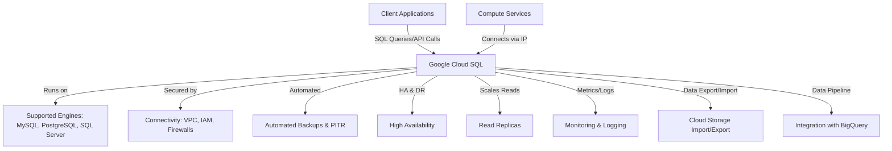
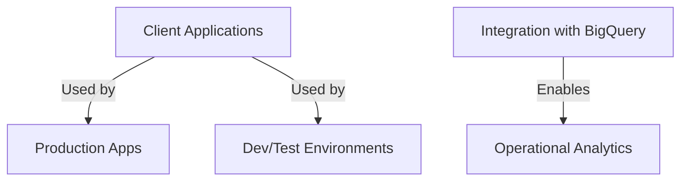

### Cloud SQL Architecture and Use Cases

#### **Cloud SQL Architecture**

- **Managed Service Model:**  
  Cloud SQL is a fully managed relational database service that runs MySQL, PostgreSQL, and SQL Server on Google Cloud. Each Cloud SQL instance operates on a virtual machine (VM) managed by Google, with persistent storage attached for durability. High availability (HA) configurations use a standby VM in a different zone for failover, ensuring minimal downtime.

- **Integration and Connectivity:**  
  Cloud SQL instances can be accessed by applications running on Compute Engine, App Engine, Google Kubernetes Engine (GKE), or Cloud Run. It supports private IP connectivity via VPC, network firewalls, and IAM for secure access.

- **Operations and Maintenance:**  
  Google automates backups, patching, failover, and monitoring. You can configure automated or on-demand backups, and restore to a previous state using point-in-time recovery. Monitoring and logging are integrated for operational visibility.

- **Resource Management:**  
  Instances can be scaled vertically (CPU, memory, storage) and horizontally (read replicas for scaling reads). Storage can auto-expand to meet growing data needs.

#### **Cloud SQL vs. Other GCP Storage Technologies**

| Feature/Use Case                | **Cloud SQL**                               | **Cloud Spanner**                                | **BigQuery**                                  | **Firestore/Bigtable**                      |
|---------------------------------|---------------------------------------------|--------------------------------------------------|-----------------------------------------------|---------------------------------------------|
| **Type**                        | Managed relational DB (MySQL, PostgreSQL, SQL Server) | Globally distributed relational DB               | Serverless data warehouse (analytics)         | NoSQL (document/wide-column)                |
| **Scalability**                 | Vertical scaling, regional HA, read replicas| Horizontal (global), automatic sharding          | Massive, serverless, analytical scaling       | Horizontal, massive scale                   |
| **Use Case**                    | Transactional/regional apps, OLTP           | Global, high-scale, strongly consistent OLTP     | Large-scale analytics, BI, ML                 | Real-time, IoT, mobile, streaming           |
| **Consistency**                 | Strong (within region)                      | Strong (global)                                  | Eventual (for analytics)                      | Eventual/strong (depends on engine)         |
| **Typical Example**             | E-commerce, CMS, ERP, SaaS                  | Global banking, gaming, supply chain             | Data warehousing, reporting, ML pipelines     | Messaging, user profiles, sensor data       |
| **Pricing**                     | Lower, per-instance                         | Higher, per-node, global                         | Query-based, storage + compute                | Usage-based                                 |

- **Cloud SQL**: Best for traditional, transactional workloads requiring SQL, regional high availability, and managed operations.
- **Cloud Spanner**: Use when you need global distribution, high throughput, and strong consistency across regions.
- **BigQuery**: Chosen for analytics on massive datasets, not for transactional workloads.
- **Firestore/Bigtable**: For NoSQL, high-velocity, or semi-structured data.

#### **When to Use Cloud SQL: Production, Development, Analytics**

**Production Use Cases**
- **Transactional Applications**: E-commerce, finance, ERP, and SaaS platforms needing strong consistency, high availability, automated backups, and security.
  - *Example*: An online retailer uses Cloud SQL for MySQL to store orders, customer data, and inventory, leveraging HA and automated failover for reliability.
- **Microservices Architectures**: Each microservice can use its own database or schema within Cloud SQL, supporting isolation and independent scaling.
  - *Example*: An order management system where services for orders, inventory, and shipping each use a separate database within a Cloud SQL instance.

**Development Use Cases**
- **Rapid Prototyping and Testing**: Developers can quickly provision, clone, or delete databases for dev/test environments without managing infrastructure.
  - *Example*: A startup spins up Cloud SQL instances for staging and QA, automating provisioning and teardown as part of their CI/CD pipeline.

**Analytics Use Cases**
- **Operational Analytics**: Cloud SQL can serve as a backend for real-time analytics by integrating with BigQuery, Datastream, or Dataflow for ETL and reporting.
  - *Example*: A logistics company streams transactional data from Cloud SQL into BigQuery for dashboarding and trend analysis.
- **Hybrid Transactional/Analytical Processing**: Combine transactional data storage in Cloud SQL with analytical workloads in BigQuery, enabling federated queries and near-real-time insights.

#### **Industry-Specific Use Cases**

- **E-commerce**: Personalized recommendations, inventory/order management, and customer data storage.
- **Finance**: Real-time transaction processing, fraud detection, and compliance reporting.
- **Healthcare**: Patient record management with HIPAA compliance, audit trails, and secure access.
- **Media/Content**: CMS backends, user profiles, and content metadata storage.

#### **Summary of Key Points**

- **Cloud SQL** is ideal for managed, transactional, SQL-based workloads where you want to minimize operational overhead and focus on development.
- It is not designed for global, multi-region, or extremely high-throughput requirements—Cloud Spanner or Bigtable may be more suitable in those cases.
- For large-scale analytics, use BigQuery; for NoSQL or real-time data, consider Firestore or Bigtable.

Cloud SQL’s managed nature, integration with GCP services, and support for major SQL engines make it a default choice for many production, development, and analytics workloads in the cloud.

